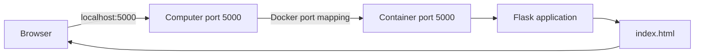

# Dockerized Flask Application

[](https://www.python.org/)
[](https://flask.palletsprojects.com/)
[](https://www.docker.com/)
[](LICENSE)

A small, beginner-friendly Flask application that runs inside a Docker container. This repository demonstrates the complete workflow from cloning source code to building an image, starting a container, mapping a port, and opening the application in a browser.

The project intentionally contains one Flask route and one HTML template so new developers can focus on the core Flask and Docker concepts.

**Public repository:** [github.com/zhargan-byte/flask-first-test](https://github.com/zhargan-byte/flask-first-test)

No local Python installation is required for the Docker workflow. Docker downloads the Python runtime and Flask dependencies while building the image.

## Quick start

If Git and Docker are already installed, follow these commands from start to finish:

```bash
git clone https://github.com/zhargan-byte/flask-first-test.git
cd flask-first-test
docker build -t flask-app .
docker run -d -p 5000:5000 --name flask-container flask-app
docker ps
docker logs flask-container
```

Open [http://localhost:5000](http://localhost:5000). A rotating Docker Flask card confirms that the application is running successfully.

When finished, stop and remove the container:

```bash
docker stop flask-container
docker rm flask-container
```

The detailed guide below explains what every command does and how to resolve common problems.

## Features

- Minimal Flask application with a single home route
- HTML interface rendered with a Jinja template
- Python 3.13 slim Docker image
- Reproducible dependency installation with `requirements.txt`
- Docker port mapping from the computer to the container
- Animated confirmation screen for successful deployment
- Beginner-oriented commands and troubleshooting guidance

## Project structure

```text
flask-first-test/
├── app.py
├── Dockerfile
├── requirements.txt
├── README.md
├── LICENSE
├── .dockerignore
├── .gitattributes
├── .gitignore
└── templates/
    └── index.html
```

| File | Purpose |
| --- | --- |
| `app.py` | Creates the Flask application, defines `/`, and starts the server on port `5000` |
| `Dockerfile` | Describes how Docker builds and starts the application image |
| `requirements.txt` | Pins the Python packages required by the project |
| `templates/index.html` | Provides the page displayed in the browser |
| `.dockerignore` | Prevents unnecessary files from entering the Docker build context |
| `.gitignore` | Prevents generated and machine-specific files from entering Git history |

## Technologies used

- **Python 3.13** — application runtime
- **Flask 3.1** — lightweight Python web framework
- **Jinja** — HTML template rendering provided by Flask
- **HTML and CSS** — user interface and animation
- **Docker** — image building and container execution

## How the application works



Flask listens on `0.0.0.0:5000` inside the container. The `-p 5000:5000` option connects port `5000` on your computer to port `5000` in the container.

## Prerequisites and Docker installation

You need [Git](https://git-scm.com/downloads) to clone the repository and Docker to build and run the container.

### Windows

1. Download [Docker Desktop for Windows](https://docs.docker.com/desktop/setup/install/windows-install/).
2. Run `Docker Desktop Installer.exe` and follow the installation wizard.
3. Use the WSL 2 backend when it is available on your system.
4. Start Docker Desktop and wait until the engine reports that it is running.
5. Open a new PowerShell or Command Prompt window.

### macOS

1. Download the correct [Docker Desktop for Mac](https://docs.docker.com/desktop/setup/install/mac-install/) installer for Apple silicon or Intel.
2. Open the installer and move Docker to the Applications folder.
3. Start Docker and complete the initial setup.
4. Wait until Docker Desktop reports that the engine is running.

### Linux

Follow Docker's official [Docker Engine installation guide](https://docs.docker.com/engine/install/) and select your distribution. After installation, confirm the Docker service is running:

```bash
sudo systemctl status docker
```

If the service is stopped, start it:

```bash
sudo systemctl start docker
```

### Verify the tools

Open a new terminal and run:

```bash
git --version
docker --version
docker run --rm hello-world
```

Successful output from `hello-world` confirms that the Docker client can communicate with the Docker engine. Depending on your Linux configuration, Docker commands may require `sudo`.

## Installation guide

### 1. Clone the repository

```bash
git clone https://github.com/zhargan-byte/flask-first-test.git
cd flask-first-test
```

To download without Git:

1. Open the [public repository](https://github.com/zhargan-byte/flask-first-test).
2. Select the green **Code** button.
3. Select **Download ZIP**.
4. Extract the downloaded archive.
5. Open a terminal inside the extracted `flask-first-test-main` folder.

### 2. Build the Docker image

Run this command from the directory containing the Dockerfile:

```bash
docker build -t flask-app .
```

- `docker build` creates an image from the Dockerfile.
- `-t flask-app` names the image `flask-app`.
- `.` sends the current directory to Docker as the build context.

Confirm that the image exists:

```bash
docker images
```

Look for `flask-app` in the `REPOSITORY` column. A successful build normally ends with a message showing that the image was named `flask-app:latest`.

### 3. Run the container

```bash
docker run -d -p 5000:5000 --name flask-container flask-app
```

- `docker run` creates and starts a container.
- `-d` runs it in the background.
- `-p 5000:5000` maps computer port `5000` to container port `5000`.
- `--name flask-container` assigns a readable container name.
- The final `flask-app` identifies the image to run.

### 4. Confirm the container is running

```bash
docker ps
```

The output should list `flask-container` with a mapping similar to `0.0.0.0:5000->5000/tcp`.

If `flask-container` is not listed, run `docker ps -a` and then `docker logs flask-container` to identify why it stopped.

### 5. Access the application

Open [http://localhost:5000](http://localhost:5000) in a browser.

If the animated Docker Flask card appears, the image, container, port mapping, Flask server, and HTML template are working successfully.

### 6. View container logs

```bash
docker logs flask-container
```

Follow new messages in real time:

```bash
docker logs -f flask-container
```

Press `Ctrl+C` to stop following logs. The container continues running.

### 7. Stop the container

```bash
docker stop flask-container
```

The stopped container remains available and can be started again:

```bash
docker start flask-container
```

### 8. Remove the container

After stopping the container, remove it with:

```bash
docker rm flask-container
```

To stop and remove it in one command:

```bash
docker rm -f flask-container
```

The `flask-app` image remains available after the container is removed.

## Common Docker commands

| Command | Description |
| --- | --- |
| `docker build -t flask-app .` | Build the application image |
| `docker run -d -p 5000:5000 --name flask-container flask-app` | Create and start the container |
| `docker ps` | List running containers |
| `docker ps -a` | List running and stopped containers |
| `docker logs flask-container` | Display application logs |
| `docker logs -f flask-container` | Follow application logs |
| `docker stop flask-container` | Stop the running container |
| `docker start flask-container` | Restart a stopped container |
| `docker rm flask-container` | Remove a stopped container |
| `docker images` | List local images |
| `docker rmi flask-app` | Remove the image when no container uses it |

## Understanding port mapping

The value `5000:5000` follows this format:

```text
HOST_PORT:CONTAINER_PORT
```

- The first `5000` is the port opened on your computer.
- The second `5000` is the port where Flask listens inside the container.

You can choose a different host port without modifying the application:

```bash
docker run -d -p 8000:5000 --name flask-container flask-app
```

With that mapping, open [http://localhost:8000](http://localhost:8000).

## Troubleshooting

### Docker command is not found

Docker may not be installed, or the terminal may need to be restarted after installation:

```bash
docker --version
```

### Cannot connect to the Docker daemon

Start Docker Desktop and wait for the engine to become ready. On Linux, check the Docker service:

```bash
sudo systemctl status docker
```

### Port 5000 is already in use

Use another host port:

```bash
docker run -d -p 8000:5000 --name flask-container flask-app
```

Then open [http://localhost:8000](http://localhost:8000).

### Container name is already in use

List all containers:

```bash
docker ps -a
```

Remove an old stopped container, or select another name:

```bash
docker rm flask-container
```

### Container exits immediately

Inspect the logs for the startup error:

```bash
docker logs flask-container
```

Correct the reported problem, rebuild the image, and create the container again.

### Browser cannot open the application

Confirm the container is running and its port is published:

```bash
docker ps
```

If the container is stopped, inspect `docker logs flask-container`. Confirm the address uses `http://`, not `https://`.

### Code changes do not appear

The code is copied into the image during the build. Rebuild the image and recreate the container:

```bash
docker rm -f flask-container
docker build -t flask-app .
docker run -d -p 5000:5000 --name flask-container flask-app
```

## Successful deployment checklist

Your deployment is complete when all of these checks pass:

- `docker images` lists the `flask-app` image.
- `docker ps` lists the `flask-container` container.
- The ports column shows host port `5000` mapped to container port `5000`.
- `docker logs flask-container` shows Flask listening on `0.0.0.0:5000`.
- [http://localhost:5000](http://localhost:5000) opens successfully.
- The browser displays the Docker Flask success card.

If one check fails, use the troubleshooting section above before moving to the next step.

## Learning outcomes

After completing this project, you should understand how to:

- Create a basic Flask application and route
- Render HTML from Flask's `templates` directory
- Make Flask reachable from a container with `0.0.0.0`
- Read the main instructions in a Dockerfile
- Build and name a Docker image
- Create, start, inspect, stop, and remove a container
- Map a computer port to a container port
- Diagnose a container with `docker ps` and `docker logs`

## Development note

This educational project uses Flask's built-in development server to keep the startup process visible and easy to understand. For an internet-facing production deployment, use a production WSGI server such as Gunicorn behind a reverse proxy or managed load balancer.

## Future improvements

- Add a `/health` endpoint for automated monitoring
- Move CSS into a dedicated static stylesheet
- Add automated Flask route tests
- Run the application with Gunicorn
- Add a non-root container user and Docker health check
- Add Docker Compose for multi-container learning
- Deploy the image to AWS ECS
- Add a GitHub Actions build and test workflow

## License

This project is available under the [MIT License](LICENSE). You may use, modify, and distribute the code as long as the copyright and permission notice remain included.
